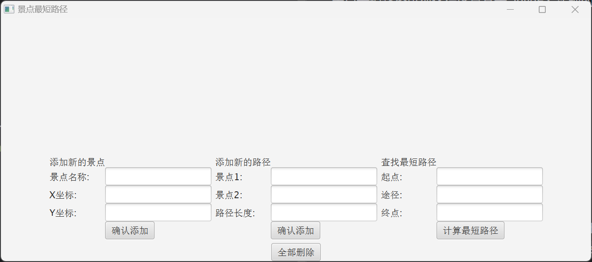

# 景点最短路径可视化程序

## 程序概要

景点最短路径可视化程序是基于 JavaFX 实现的加权图最短路径可视化程序，该程序允许使用者自由添加景点，景点之间的路径长度，自定义需要的起点、终点、途经点，并能将添加的景点以可视化的加权图进行展示。

## 开发环境

- 运行环境：JDK 1.8
- Maven: ^3.8.1

打包请使用 Maven -> Lifecycle -> package 进行打包

## 使用指南

1. 先添加足够多的景点（结点）并定义其X、Y坐标（景点名称可以使用中文）
2. 定义足够多的两个景点之间（边和权重）的距离（景点名称可以使用中文）
3. 确保构建的加权图中不存在入度和出度都为0的结点
4. 定义起点和终点（景点名称可以使用中文）后可以计算之间的最短路径
5. 途径的景点可以为空，若不为空且经过多个景点时必须使用空格分割（景点名称可以使用中文）
